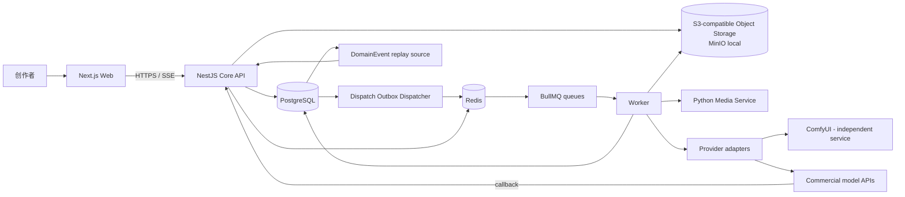

# AI Drama Studio V1 架构

## 边界与上下文

PostgreSQL 是业务状态、审计、幂等记录和恢复依据的唯一可信来源。Redis/BullMQ 仅分发工作；Provider 与 ComfyUI 仅执行请求，不拥有项目状态。

## 容器级职责

| 容器 | 负责 | 明确不负责 |
| --- | --- | --- |
| Next.js Web | 创作 UI、版本选择、任务可视化、SSE 消费与轮询兜底 | 业务状态判定、密钥、模型调用 |
| NestJS Core API | 鉴权、事务、领域规则、任务持久化、SSE、Provider 回调验签 | 执行长任务、媒体编码 |
| PostgreSQL | 所有领域实体、状态、审计、成本与来源 | 大文件二进制、队列分发 |
| Redis + BullMQ | 短暂调度、延迟重试、Worker 协调 | 最终任务真相、资产元数据 |
| Worker | 领取数据库任务、调用 Adapter、恢复/超时扫描 | 绕过领域规则直接改项目内容 |
| Python Media Service | FFmpeg 合成、探测、转码、字幕烧录 | 项目/审核状态、Provider 选择 |
| ComfyUI | 本地工作流的图片/视频推理 | 访问 Core 数据库、持有业务密钥 |
| Object storage | 原始和派生媒体对象 | 业务查询、授权决策 |

## 同步与异步流

同步 API 只完成验证和短事务：创建/编辑修订、创建 `WorkflowRun` 与 `GenerationJob`、写入 outbox、返回资源或 `202 Accepted`。每次 Job 在同一事务进入 `QUEUED` 时递增 `dispatch_seq` 并写入一个新的 DispatchOutbox；事务提交后 dispatcher 仅以 `{jobId}:{dispatchSeq}` 把该调度信号放入 BullMQ，不决定业务状态。Worker 只在 Job 仍为 `QUEUED` 且消息 `dispatchSeq` 等于当前 `dispatch_seq` 时，以条件更新取得租约，读取不可变输入快照，写入 `JobAttempt`，调用 Provider，并将结果、资产、成本和最终状态在数据库事务中落盘。

长时 Provider 采用 submit/query/cancel。回调进入 API 时先验签，poll 和 callback 均写入 ProviderEvent，以 `(provider_configuration_id, provider_request_id, normalized_event_key)` 去重，再由事务更新对应 attempt/job；轮询是回调的兜底。所有状态变更在同一事务追加 DomainEvent，SSE 只读取该表并支持 `Last-Event-ID` 保留窗口重放；客户端按 event id 去重，窗口外以资源查询轮询恢复。

## 部署拓扑

生产环境可从同一版本镜像部署 `web`、`core-api`、`worker`；Python 媒体服务单独部署。它们访问托管 PostgreSQL、Redis 和兼容 S3/OSS 的对象存储。ComfyUI 部署在隔离 GPU 主机或网络段，只暴露给受控 Adapter。商业 Provider 只能从 Worker 出站访问。反向代理终止 TLS，Core API 是唯一公网业务 API；回调 URL 仅暴露专用、限流且验签的入口。

本地开发使用：Web、Core API、Worker、Python 媒体服务、PostgreSQL、Redis、MinIO；ComfyUI 是可选的独立本地服务。此文档不声明这些组件已存在或已启动。

## 配置、密钥与存储

- 非秘密配置（队列名、超时、公共对象存储域名、功能开关）经环境变量或配置文件注入并校验。
- Provider API Key、回调签名密钥、S3 凭据只能由运行时密钥注入；不进入浏览器、数据库明文、日志、任务输入快照或 Git。
- 对象键按 `workspace/project/asset-kind/asset-id/revision` 分区，使用随机对象名；数据库保存内部 `storageKey`、存储提供方、哈希、大小、MIME、保留策略和来源，而非永久 URL。
- 上传先创建独立 UploadSession 并由 API 签发短期、受限预签名 URL；它不是 Asset。完成端点读取对象元数据并校验 MIME、大小、SHA-256 和权限，再在同一事务创建最终 Asset、将会话标为 `COMPLETED` 并写入 DomainEvent。下载通过授权后的短期 URL。

## 错误、可观测性与安全

API 返回稳定错误码、可安全展示的摘要及 `traceId`，绝不把 Provider 密钥、原始响应中的秘密或堆栈暴露给 Web。可重试错误写入 job；不可重试的输入/授权/策略错误立即失败。日志采用结构化字段 `traceId, projectId, jobId, attemptId, providerRequestId`；指标至少包括队列延迟、任务状态、Provider 延迟/失败率、回调重复率、合成耗时和成本。审计日志记录谁在何时创建、批准、取消或导出。

认证后的所有资源查询都以 `workspace_id` 过滤，即使 V1 只有一个工作区。对象存储、ComfyUI、Redis、PostgreSQL 不向浏览器公开；API 做输入长度/MIME/尺寸限制、回调签名验证、速率限制与授权检查。媒体服务只接受已授权的内部任务令牌和对象引用，不接受任意路径或 shell 参数。

## 审查后数据库一致性基线（本节优先）

唯一采用 transactional outbox：API 在同一 PostgreSQL 事务中创建/变更 `GenerationJob`、必要的领域状态、DomainEvent 和 DispatchOutbox；每次进入 `QUEUED` 都递增 Job 的 `dispatch_seq` 并插入新的 outbox 行。dispatcher 以 `{jobId}:{dispatchSeq}` 幂等投递 BullMQ，并仅在成功后填写 `dispatched_at`；唯一约束为 `(job_id, dispatch_seq)`，不复用或清空旧行。扫描器重投未分发或超出调度宽限的记录。不得在事务内直接向 BullMQ 投递，也不得以 BullMQ 是否存在消息判断 job 是否存在。

Worker 收到消息后，必须确认 Job 为 `QUEUED` 且消息 `dispatchSeq` 等于 Job 当前 `dispatch_seq`，再以条件更新从数据库领取执行租约；旧消息只安全退出。重复消息、Redis 丢失和 Worker 重启均可安全处理。租约过期时，reconciler 对已有 `provider_request_id` 的 attempt 先 `query`，无远程请求的才按同一 Job 的下一 dispatch sequence 重新调度。每一次状态、成本、资产或进度事件都在数据库提交后写入可重放的 DomainEvent；SSE 只发布这些已提交记录。DomainEvent 不是 BullMQ 队列，也不是 DispatchOutbox。

对象存储中的用户上传临时对象只由 UploadSession 跟踪；上传失败、过期或未完成绝不创建 Asset。Provider 下载对象使用受控内部暂存，在完成校验后才创建最终 Asset。下载永远由授权 API 签发短期 URL；清理器只在数据库引用、UploadSession 状态和保留期检查后删除孤儿对象，业务软删除不会立即物理删除文件。

数据库与 Redis 凭据同样只由运行时密钥注入，且各服务使用最小权限账户；签名 URL 绑定对象键、HTTP 方法、大小/MIME 条件和短 TTL。上传的文件名不能参与对象键或 FFmpeg 命令，API/媒体服务拒绝路径分隔符、任意本地路径与未允许 MIME/尺寸。Provider/媒体下载只允许已配置 Provider 的 allowlist 域名和受控对象引用，不跟随任意用户 URL，防止 SSRF。Python 服务以参数数组调用固定 FFmpeg 二进制和受控临时目录，绝不拼接用户 shell 字符串；ComfyUI 仅可由 Adapter 所在网络访问。Prompt、原始响应、错误和日志均按敏感字段脱敏并受访问控制。
