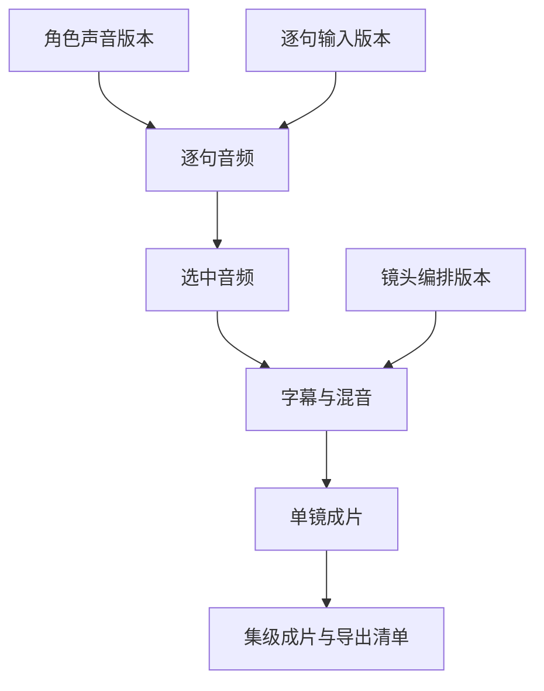

# 红果角色配音与声音导演设计

状态：**产品与技术设计，待独立审查；功能未实现，真实配音未验收**。

设计日期：2026-10-07。核验主线 `2fb19acfe086392eb415a3be92b4c4a6830a4cfd`；新手界面参考 PR #50 的 `5cda55b67a7b37c9c72fa5b00f3699adbc203fac`，该 PR 尚未合并。本设计不覆盖正在进行的新手五步验收，不提前修改 PR #49/#50。

本轮仅设计文档及离线交互原型：Migration 执行=NO，SQL 草案=未改/未执行，模型调用=NO，Deploy=NO。

## 1. 首选与交付目标

让没有剪辑经验的创作者完成：**给角色选声音 → 生成一小段 → 试听并确认 → 自动排好对白与字幕 → 看整段效果 → 审核导出**。

首批采用一个云端 TTS Provider 的已授权预置音色，技术首选为百炼 CosyVoice 系列；具体 model/voice/地域/价格须以账号可用能力与批准的配置快照为准。文本千问密钥或授权不自动等于语音调用授权。开源 CosyVoice 是后续自托管候选，与百炼托管服务是两种部署及商业条款，不混为一谈。

网页、任务、审核、费用、来源追溯继续由红果管理。不要将外部配音工具的独立 UI、账号体系、工作目录或任务数据库整体搬入红果。开源调查见 [VOICE_OPEN_SOURCE_RESEARCH.md](VOICE_OPEN_SOURCE_RESEARCH.md)。

第一可交付成果是：**一个场景、两个角色、4–8 句中文对白，固定角色声音，单句可重做，合成后每句完整可听，字幕对应已选音频，可以批准和下载。** 固定三集与现有 90 秒上限保持；这不是口型同步或完整商业运营验收。

## 2. 面向小白的五步流程

| 原步骤 | 加入的能力 | 用户只需决定 | 完成依据 |
| --- | --- | --- | --- |
| 定故事 | 描述故事，提示后续将配置角色声音 | 故事是否满意 | 沿用当前修订与审核 |
| 看剧本 | 把对白整理为角色、台词、语气、停顿；旁白单列 | 谁说哪句话，有无读错的人名 | 已保存且已审核的来源；结构化台词明确确认 |
| 定人物 | 角色卡增加声音；支持筛选、预置试听、选择与更换 | 这个声音像不像角色 | 服务器保存的音色版本，不是本地勾选 |
| 试一段 | 先生成一个代表镜头/小段的配音；逐句试听、单句重做、选择版本 | 语气、读音和节奏是否满意 | 当前选中 take 的内容、来源和实际音频均有效 |
| 出成片 | 汇总待配音台词，确认费用，补齐未完成项；对齐、混音、字幕、审核导出 | 是否认可整集效果 | 每句已选音频、字幕与时间线通过预检；成片审核通过 |

导航仍保持五步，不另加需要新手理解的“音频工程”一级流程。高级工作台提供同一数据的详细面板。

### 2.1 定人物：声音卡

- 卡片：角色名、简短人物定位、声音名称、语言/方言、语气标签、可用状态。
- 默认展示少量推荐声音，推荐来自显式规则与用户筛选；没有调用模型就不叫“AI 已分析”。
- “听声音”优先播放允许使用的预置示例。用本剧台词试听会产生一次真实调用，必须经过费用确认。
- 首批默认普通话；粤语等仅在所选 model/voice 明确支持并验收后显示，不做通用承诺。
- 同一角色在同一项目默认共用一个已确认声音版本；旁白也是明确的 speaker，不能把无法识别的角色自动当旁白。
- 声音版本包含 Provider、模型/模型版本、voiceId、语言、支持能力及授权来源；模型与音色不跨产品混用。
- 更换声音先显示“影响 N 句对白、M 个镜头、K 个成片”的真实影响清单，确认后保存新版本并使相关下游失效；不自动付费重做。

### 2.2 试一段：逐句卡片

一张卡片只解释一个决定：谁在说、说什么、现在听起来怎样。主操作随状态变化：生成本句 → 试听 → 使用这一版。次操作是编辑与重新生成。

基础字段：角色、台词、自然/高兴/难过/生气等服务实际支持的情绪、正常语速、停顿。发音纠正与高级参数折叠。供应商不支持的参数不显示可用控件，也不得偷偷丢弃。

生成完成不自动选用。已有选中音频时，“再试一版”生成候选，旧选中版本保持，直到用户确认新版本。只重做本句，不整集重生成。顺序可调整；台词正文改变必须产生新计划版本，保持原稿可追溯。

修改人名读法、数字读法等，可区分“字幕显示文本”和“发音文本/词典”。语义改变必须重新走来源编辑与审核，不能以发音修正名义跳过剧本规则。

### 2.3 声音与画面：异常先解释

- 无对白镜头允许保留环境声或静音，不强迫调用 TTS。
- 配音短于镜头：默认保留自然停顿，在尾部补静音，不拉长每个音节。
- 配音长于镜头：阻断新声音方案的合成。展示实际超出时长，提供“修改台词”“用支持的语速重新生成”“返回调整镜头”入口。
- 不裁掉一句话尾部，不循环画面、不冻结尾帧、不擅自加速人声凑时长。
- “调整镜头时长”只有存在对应视频能力时才可执行；`durationHint` 不是已生成视频的实际长度。
- 对尚未生成真实视频的未来路线，优先先确定配音时长再安排镜头；既有视频按其 ffprobe 实测时长校验。
- 一镜头多角色首版按顺序轮流讲话；重叠对白、多人同时说话进入后续高级能力，不自动重叠。
- 音乐遇对白自动降低音量、片尾淡出；用户能关闭音乐。默认禁止原视频人声与新配音重复叠加；允许保留经确认的无对白环境声轨。

### 2.4 出成片：一页检查

显示缺失台词、未确认声音、旧版本、超时、字幕待校正及费用待核实。质量阻断与费用记录状态分开表达：金额未知不能显示“免费”，也不能隐瞒已经发生的调用。

先确认单集预览，再提交成片审核。导出继续使用既有资格判断，清单新增 speaker/voice 版本、每句 take、台词计划、字幕时间线、混音配置、模型与内容哈希。历史 STALE 成片可查看，不当作当前可正式导出的成片。

## 3. 页面与交互规范

离线交互原型：[design/character-voice-preview.html](design/character-voice-preview.html)。全部数据为设计示例，没有 API、模型、录音或支付调用。原型按钮仅演示交互，不代表已实现。

[桌面/手机设计图与原型检查记录](design/README.md)可直接在仓库查看。原型文件下载后可用本地浏览器打开。

沿用新手版：底色 `#F7F6F2`、白卡、正文 `#24232A`、主操作 `#D34846`、边框 `#E7E5E0`、圆角 12px、正文 16px。

桌面：左侧上下文，中间当前任务，右侧简短检查与下一步。手机：单列、横向可滚动步骤栏、底部操作留足安全间距；不以缩小字号塞满。

| 状态 | 用户文案 | 可执行动作 |
| --- | --- | --- |
| 未配置 | 配音服务尚未开启，可先保存台词和选声草稿 | 保存、返回 |
| 未绑定声音 | 先为林晚选择声音 | 选声音 |
| 等待开始 | 已受理，正在等待配音 | 查看任务、取消未发送部分 |
| 生成中 | 正在生成本句 | 查看任务，不重复提交 |
| 结果未知 | 服务商可能已处理，本次结果和费用待核实 | 查询/人工核实，不自动再生成 |
| 待试听 | 生成完成，听一下再决定 | 试听、使用这一版 |
| 选中有效 | 已选用第 2 版 | 试听、另生成候选 |
| 来源更新 | 台词或角色声音已变化，请重新确认 | 查看差异、生成当前版本 |
| 超时 | 这句超过镜头可用时长 1.2 秒 | 修改台词/语速/镜头 |
| 存储故障 | 暂时无法读取声音，未新增生成任务 | 重新读取 |

所有控制具备中文 accessible name；键盘可选声、试听、关闭弹窗，关闭后焦点返回原按钮。试听采用单播放器互斥，不自动播放多个角色声音。页面卸载/项目或镜头切换中止前端读取并丢弃迟到回执，不取消已发出的服务商任务。

## 4. 现有代码的可复用与缺口

| 能力 | 已核实的当前事实 | 新设计处理 |
| --- | --- | --- |
| 台词 | `ShotRevision.dialogue` 是可空字符串，没有逐句 speaker、voice、起止时间 | 新增版本化结构化配音计划；不把正则猜测当持久化真相 |
| Provider | 已有 `audio.tts`、Job/Attempt/ProviderEvent/费用框架 | 复用框架，新增真实 Speech Adapter 与独立执行策略 |
| 成功写入 | `packages/database/src/mock-media-cost.ts` 的 `assertSyncActualCost` 限定 Mock 零美元 | 不放宽 Mock 校验；真实收费使用专门 receipt/账本处理路径 |
| 音频内容 | API、落库、预检对当前 Mock WAV 有固定校验 | 新的受控真实音频内容路径，保留旧 fixture 校验 |
| 音频审核 | 正式 migration 的 `asset_approval_kind_check` 不允许 AUDIO 被标 APPROVED | 配音采用独立“选用确认”，不偷偷改变 Asset 审核约束 |
| 合成 | `compose-preflight.ts` / `compose-render.ts` 的 `audioOverflow=trim-to-video-end`；Python `compose_cli.py` 使用 `atrim` | 新声音 manifest/profile 采用超时阻断；不改写历史 v1 快照 |
| 字幕 | 当前是固定 Mock VTT | 从选中音频的时间戳生成真实字幕并校验，不复用固定字幕 |
| 新手界面 | PR #50 的 cast/sample/final 复用旧组件 | 同一 voice 组件由两种工作台共用，不复制生成/保存状态机 |

入口参考：`apps/api/src/studio/studio.service.ts`、`apps/worker/src/runtime/mock-av-generation.ts`、`apps/worker/src/runtime/mock-media-recovery.ts`、`packages/providers/src/media-adapter.ts`、`packages/domain/src/compose-preflight.ts`、`packages/database/src/media-assets.ts`、`services/media-worker/src/media_worker/compose_cli.py`。实施前按最新主线复核路径和约束。

## 5. 数据模型草案（需要新 Migration，尚未授权执行）

以下为逻辑模型，不是已存在的表，也不是执行 SQL。第一轮数据库设计必须验证复合 FK、唯一约束、rowVersion、删除/保留策略、权限与失效传播；不借用尚未执行的千问/参考图草案承载配音数据。

### 5.1 角色声音绑定

`ProjectVoiceBinding`：workspace/project、characterId 或明确的 NARRATOR、currentRevisionId、rowVersion。非旁白只能绑定同一项目的角色。

`VoiceBindingRevision`：不可变 ProviderConfiguration/version、model/version、voiceId、locale、能力快照、默认表演参数、授权说明引用、内容哈希、创建操作者。绑定角色的稳定身份；外貌等无关字段编辑是否影响声音，由显式依赖决定，不能全量失效。

预置音色目录先采用经过审核的服务端版本配置；不必第一期再建公共音色商城。第三方音色移除后旧回执仍可查看，新生成禁用，不自动改成另一声音。

### 5.2 镜头配音计划

`ShotSpeechPlan` aggregate + immutable revision：绑定当前 shotRevisionId、sourceDialogueHash、speaker/voice 修订引用、orderedLines、timingPolicy、rowVersion。

每个 line：稳定 lineId、不可变 lineInputRevisionId/inputHash、ordinal、speakerBindingRevisionId、displayText、spokenText/发音词典引用、emotion、speed、pauseAfterMs。语音生成输入版本与整份编排版本分开；只调整顺序或句后停顿时不重新生成相同人声，但更新混音/字幕计划。首版不得生成自由 SSML 或把用户字符串直接送入命令/FFmpeg 表达式。服务端限制长度、字节数、行数、参数范围，按 Provider 实际能力进一步收紧。

对旧 `dialogue` 的拆句只产生待确认草稿。说话人不明必须让用户指定；不凭语序自动选择角色。编辑对白正文先保存新的 ShotRevision 并按既有规则审核，再冻结配音计划；不能让配音正文脱离已经批准的对白。

### 5.3 配音候选与选用

候选优先复用 `Asset(kind=AUDIO)`，metadata 记录 speech schema、生成时 planRevision、lineId、lineInputRevisionId/inputHash、voiceRevision、providerReceipt、时长、采样率、声道、checksum、alignment 引用。任务/attempt/输出身份由服务端关联，不接受客户端声称的 Provider 信息。

`SpeechSelection`：针对当前 planRevision + lineId 选择一个 takeAssetId，以 If-Match CAS 写入，并持有项目锁验证声音和台词均有效。存确认者、确认时间、内容哈希、rowVersion。这是使用选择，不等同于 AUDIO 的 APPROVED。

同一 ShotRevision 内更新计划时，对未变台词逐句验证 lineInputRevision/inputHash、声音版本、Provider 参数与资产可用性，显式继承旧选择并记录 inheritedFromSelectionId；不得只按句子文本相同就继承。这样修改一句情绪或一个角色声音，不会迫使其他不变句再次付费。旧 take 仍记录原生成计划，新的选择关系说明继承来源。ShotRevision 改变时第一期仍不跨镜头修订自动继承。

其他 take 保留为候选/历史。仅打开候选、试听、修改未保存参数不使已确认成片失效；确认替换或来源变化后才传播。新任务迟到结果仍归旧生成记录，不能自动选入当前计划。现有 AssetDependency 可表达音频到字幕/合成的边；新增 voice/lineInput revision 以及 plan 到编排产物的强类型依赖需新增关系或扩展引用约束，不能只靠 metadata JSON 扫描保证一致性。

逐句 AUDIO 的有效性依赖 lineInputRevision、voiceRevision、Provider/处理版本和原 ShotRevision。生成时 planRevision 只保留来源，不作为整份计划变化时的 AUDIO 失效边。新 planRevision 影响选择关系、字幕时间线、混音与成片；未变台词的 AUDIO 可通过上述显式继承继续使用。

### 5.4 请求与预算持久化

`SpeechRequestReceipt`：关联 job/attempt、唯一内部 operationId、输入哈希、ProviderConfiguration 版本、vendorRequestId（可能尚无）、调用状态、输出受限引用、用量和价格版本、最后观测时间。须在外部请求前建立不可重复发送的持久化边界。

预算采用工作区级 `SpendAuthorization` / reservation 逻辑：冻结授权上限、币种、过期时间、已占用金额及状态，事务内原子预留。没有完整账户时只开放给受鉴权的工作区操作者，不能让匿名访问者消耗服务商额度。不是会员余额、充值或支付系统。

优先扩展已有可用的持久化结构；无法提供唯一性、fencing、预算并发与恢复语义时，再为上述 receipt/reservation 建专表。最终 SQL 与回填方案单独 Review，不在本设计提交中生成或执行。

## 6. API 合同草案

以下路径为设计建议，均尚未实现；以 `/api/v1` 同源入口。所有作用域由服务器工作区身份推导，不能信任客户端 workspaceId。

| 方法/资源 | 作用 | 写入/费用 |
| --- | --- | --- |
| GET `/projects/:id/speech-capabilities` | 音色目录版本、服务可用性、参数和语言、费用可见性 | 只读、无调用费 |
| PUT `/projects/:id/voice-bindings/:speakerId` | 保存角色声音新版本与影响范围 | If-Match + 幂等；无 TTS 调用 |
| GET/PUT `/shot-revisions/:id/speech-plan` | 查看/保存结构化计划 | CAS；保持来源与权限 |
| POST `/speech-plans/:revisionId/quote` | 返回冻结输入的估算、币种、计价版本、到期时间、可复用项与不确定项 | 不生成声音；不得把估算写为实际费用 |
| POST `/speech-plans/:revisionId/generate` | 提交明确 lineIds + quoteId/授权引用 | 幂等；服务端验证输入与报价一致、预算、门槛后 202 |
| GET `/speech-plans/:revisionId/takes` | 分页返回候选及选中信息 | 只读；选中项不能因不在第一页而丢失 |
| PUT `/speech-plans/:revisionId/selections/:lineId` | 明确选用音频并使依赖旧选择的合成失效 | CAS + 幂等；无模型费用 |
| POST `/speech-plans/:revisionId/mix-preflight` | 校验时长、字幕、声音计划与视频的匹配 | 只读；返回可核对的 manifest/hash |

继续复用任务读取和取消 API。真实付费重试策略必须按 Provider 能力另行定义，不能套用仅允许 Mock 的手工 retry 规则。后台返回结构化 reasonCode，UI 翻译为可执行提示；敏感路径、令牌和服务商签名 URL 不返回浏览器。

第一期提供逐句生成；批量生成只有 quote/reservation/部分完成/取消语义通过后才开放。“本集全部生成”最终创建可追踪的逐句 Job，不做一个无法恢复的大请求；已成功有效项保留，只补缺失项。

## 7. 生成、重试与成本规则

1. 鉴权、schema/字节限制、来源门槛、服务商能力和预算检查均在预约前完成。
2. 事务内创建 operation/Job/outbox/预算预留，冻结输入。提交后再访问外部 Provider，网络期间不持数据库行锁。
3. Worker 在调用前原子领取一次性 dispatch 权限。请求可能已发出而回执未保存的崩溃窗口按 UNKNOWN 处理。有查询能力时只查询并恢复原请求；只有上游已验证的幂等保证，或可靠查询明确证明从未受理且允许安全重发时，才能再次发送。单纯有 requestId 或可查询不构成重发许可。
4. UNKNOWN 是额外的调用回执状态，复用现有 Job 非终态表示等待核实；不擅自向全局 Job 枚举加入状态，也不重开终态。
5. 收到响应后先幂等持久化已知请求身份、受限输出引用及费用观测，再下载、写受控暂存、校验和落盘。流式结果也尽早保存已知身份，完整结束前不当成功。存储失败只恢复输出，不能重新付费生成。临时 URL 立即转存；过期而无法取得结果时标记输出丢失，保留费用事实。
6. 输出校验通过且当前 attempt 有效，才写 Asset、来源边、成功事件；被取消/替代的结果不能进入当前成片。
7. **费用观测与产物可用性分开。** 已确认的服务商费用即使在取消、失效、输出损坏后到达，也应幂等入账；Job 不因此恢复成功。实际费用 key 绑定 provider/config + vendor request/usage receipt，重复回调不重复计费。
8. ESTIMATED 与 ACTUAL 按原账本规则明确关联替代。未知金额保持未知；失败不等于免费，用户取消不等于服务商退款。本地编码费用仍单列未计量。
9. 已发出的调用结果未知时，不自动重发、不自动切模型、不释放可能已消费的预算。用户明确选择另发调用时创建新 operation、显示潜在重复费用并再次预留。
10. 应用幂等只保证自己不重复创建/发送同一操作，不能承诺服务商“绝不会重复收费”。

复用键包含 workspace/project、shotRevision、lineId/lineInputRevision、voiceRevision、规范化发音文本、全部影响声音的有效参数、Provider/model配置版本与处理版本。整份 planRevision 只参与编排与来源引用，不单独使未变台词的音频缓存失效。同一 shotRevision 内跨计划版本按上述逐句继承规则验证；第一期不跨项目、镜头或 ShotRevision 复用。有意重做加显式 nonce。读取出现 EACCES/EIO 等存储故障时返回错误，不把故障当未命中发起新调用。

试听分两种：已有示例/已有 take 不触发生成；用用户台词生成试听明确计费。报价缺失时不能展示虚构金额，真实批量入口保持不可用；授权的一次小额联调可走单独的有限调用许可。

## 8. 对齐、字幕与合成

首版每句分别生成，探测真实时长并用同一份顺序/停顿清单产生句级字幕。更精细切分优先使用所选 TTS 音色实际支持的时间戳；没有时间戳时，将**已知台词 + 实际生成音频**交给 forced alignment；不为已知剧本额外引入完整翻译流水线。WhisperX 等仅为可替换候选，语言模型、依赖和结果质量须另验。

保留 `spokenText → displayText` 映射。数字、英文、人名、多音字无法可靠对齐时标为待校正，不能把字符数均分当成真实逐字时间戳。第一期允许可靠的逐句字幕，不承诺卡拉 OK 逐字高亮。

字幕必须引用确切 take checksum 和 alignmentVersion。重新生成或更换 take 后重新对齐；字幕编辑只改变显示或分段时也生成新的 subtitle revision，不覆写历史。所有 cue 时间单调、在有效音频范围内，重采样/修剪头尾时同步换算。

建议新的版本化声音 manifest（名称暂定 `voice.shot.mix.v1`）记录有序 line take、显式 start/end、停顿、总时长、音乐选择/音量、原声策略、字幕引用、重采样与混音 profile。服务端从真实输出与计划构建，不让客户端伪造时长。

新 profile 使用 48kHz 的规范化中间音频与适合 MP4 的输出格式，具体声道/codec由实际 FFmpeg 构建验证；保存无损源音频与最终播放音频哈希。voice、music、ambience 角色明确。字幕、混音、成片均连接到实际使用的输入资产。

新声音方案的超时规则为 reject，不复用旧 `trim-to-video-end`。历史 `m4.shot.compose.v1` 和已通过 fixture 保持原样；新 profile 必须具有独立的合同、读取白名单和测试。原 2–30 镜头、单集 90 秒、文件大小及资源上限仍适用，超限返回用户可处理的错误。

调音目标（待听感验收）：对白清楚、无削波，音乐在说话时降低，句间停顿自然。不要把某一 LUFS 值声称为红果官方交付标准；无用户指定平台规范前按可配置技术目标验证。

## 9. 来源失效与并发

确认换声、保存新对白计划、确认换 take、修改混音或字幕，都只使显式依赖的下游失效，不删除旧音频、不撤销账本、不篡改 APPROVED 历史。未使用的候选生成不触发整集失效。

沿用共同项目锁顺序：项目 → aggregate → selection/asset。声音变更、选用确认与合成完成复核必须在同一序列化边界下操作。先合成成功后改选：扫描能看到成片并失效；先改选后合成：旧 manifest 不能写 ACTIVE 成片。旧 attempt fencing、原有取消与成功竞争规则继续保留。

预检结果不是永久许可。合成提交和完成分别复核冻结输入与当前资格；导出沿用最终来源复查。前端以对象身份、操作世代、读取世代与 rowVersion 丢弃迟到响应。

## 10. 开源/云端与运行边界

首批：百炼官方云语音接口候选 + 红果自身 UI/Job/数据库 + 当前 FFmpeg。没有选定账户/地域/配额/凭据时，只能交付离线 adapter 合同与关闭态，不能记为真实配音可用。

后续自托管：CosyVoice 独立推理服务，独立 Python 环境/GPU资源/并发队列；不把 torch/CUDA 依赖安装进当前 Web/API 或 FFmpeg venv。接口可沿用 Speech Adapter，不能假设开源和云端有相同 voiceId、参数或计费。

真人声音克隆不在第一期。后续必须有声音来源与使用授权记录、可撤销与删除方案；不内置明星模仿入口。第三方仓库代码许可证、权重许可证、预置声音/训练素材权利、API合同分别核验；开源不等于推理零成本。

密钥仅在服务端；禁止浏览器存服务商密钥。输出下载限制官方允许主机、重定向、协议、字节数、时长与格式；禁止任意 URL/本地路径。已知存储系统错误与坏文件分类延续 PR #48 的规则。无登录/多租户的当前阶段仅面向有鉴权的测试操作者，不公开放开花费入口。

## 11. 分期与实施顺序

| 阶段 | 交付 | 出口条件 |
| --- | --- | --- |
| V0 本轮 | 设计、开源调查、离线原型、实施交接 | 文档与原型审查；无运行功能声明 |
| V1-A | 结构化台词/音色版本/选择/回执/预算的合同与数据库方案，离线 Speech Adapter | 定向测试；Migration 草案独立 Review，未授权不执行 |
| V1-B | 一个 Provider、预置音色、双角色逐句生成/试听/选用 | 经授权专用库与有限真实调用，失败/UNKNOWN/费用核对通过 |
| V1-C | 精确字幕、时长冲突处理、混音、新合成 profile、导出来源 | 新手页面真实短片闭环；音频完整、口径真实 |
| V1-D | 有预算边界的单集补齐、局部重做、并发恢复 | 批量幂等、部分失败、取消、不重复收费事实验证 |
| 后续 | 自托管、授权克隆、口型同步、多语言、重叠对白 | 单独确定资源、模型与真实质量基准 |

当前 PR #49/#50 先按自己的验收/Review 结束。后续功能从届时已核实主线独立建 `feat/character-voice-workflow`，不要在新手 UI PR 中顺带改数据库和真实费用逻辑。

需要 Owner 确定的最小外部条件：服务商账号/地域与允许模型，服务端密钥注入方式，单次和每日调用预算/币种，数据库 Migration 执行对象与授权。此设计及普通 Git 授权不包含这些动作。

## 12. 验收矩阵

以下均为未来必需验收，不是本轮通过记录。

| 编号 | 验收点 | 必需证据 |
| --- | --- | --- |
| VOICE-01 | 多角色台词/旁白归属，刷新保留，错项目拒绝 | 真 API/数据库 + 新手浏览器 |
| VOICE-02 | 音色版本保存、被移除音色/不支持参数拒绝 | 合同单测 + 真库 |
| VOICE-03 | 一句一次受理，同键重放同结果，不同输入 409 | 并发真实数据库 |
| VOICE-04 | 发送前/发送后崩溃、5xx、超时、流截断不自动重复付费 | 故障注入与 adapter 实测 submit 计数 |
| VOICE-05 | 音频下载/落盘失败只恢复已得结果，IO故障不新建任务 | 真文件系统与调用计数 |
| VOICE-06 | 单句重做保留旧选择；未变句显式继承、不再次调用；旧响应不选入新计划 | 页面交互、真库与逐句调用计数 |
| VOICE-07 | 换音色/选take与完成并发，相关下游 STALE、无关镜头保留 | 真 PostgreSQL 锁等待与两种提交顺序 |
| VOICE-08 | 已发送后取消仍可记录真实费用，不创建可用资产、不重开 Job | 独立账本与服务商回执/测试receipt |
| VOICE-09 | 报价过期、预算并发、结果未知预留不提前释放 | 真库与边界测试 |
| VOICE-10 | 全句完整，无裁尾；长音频阻断；短音频不变音拉伸 | 真实 FFmpeg、波形/时长/完整解码 |
| VOICE-11 | 数字/人名/英文、重新选take后的字幕对应正确音频 | 对齐证据、人工试听 |
| VOICE-12 | 同一场景双角色4–8句，1080×1920成片可播放与下载 | 新手路线Chrome、mp4/manifest checksum |
| VOICE-13 | 390px操作、焦点、失败恢复、卸载/切换、串行轮询 | 真浏览器+必要组件回归 |
| VOICE-14 | 旧Mock/高级工作台、原52阶段不退化 | 当次SHA的既有CI |
| VOICE-15 | 服务未开/无密钥/结构缺失/无授权不能产生外部调用 | 调用次数0与错误响应 |

人声听感需授权真实测试：清楚听懂全部台词、无漏字重复、角色声音保持可辨、情绪无明显失真、对白不被音乐遮盖。中文 CER/ASR仅辅助，不替代人的试听；没有真实人声测试就不能宣称配音效果通过。

## 13. 给实现 Agent 的交接

从本文件、开源调查、最新 `IMPLEMENTATION_PLAN` / `V1_DELIVERY_MATRIX` 和当前主线代码开始。不要重复搜索一批工具，不整体移植外部仓库，不改旧 Mock 为收费路径。先完成 V1-A 的合同、UI接线设计与Migration提案；缺外部条件时把开关关闭态、离线测试、调用/费用恢复契约做实，明确“待真实验收”。

允许在新功能分支修改本配音相关的 contracts/domain/database/API/worker/providers/media-worker/Web及测试文档；每次后端变更说明原因、影响、Migration与验证。保留未提交文件，选择性commit/普通push/PR。默认不执行新Migration、草案或付费调用，不借本设计批准生产启用。独立Review与当前CI通过后再按仓库既有Git/部署约定推进。

最终 `CHARACTER_VOICE_DELIVERY_REPORT` 必须区分设计/已编码/Mock测试/真实TTS/真浏览器/已部署，并列模型地域版本、调用次数、已知/未知费用、receipt与产物哈希、新旧流程CI、Migration实际状态。未知的质量、费用和恢复能力不能写成“已完成”。
