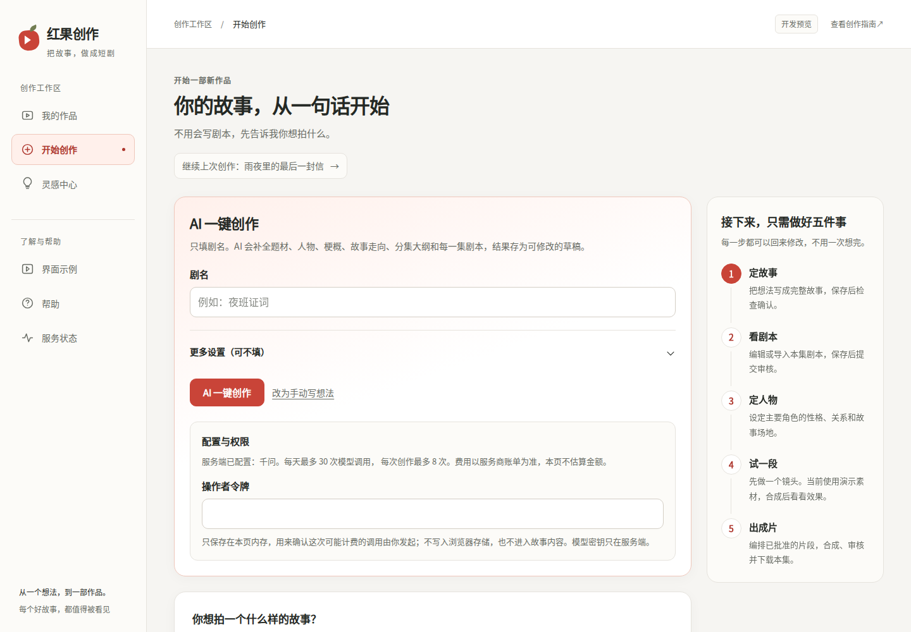
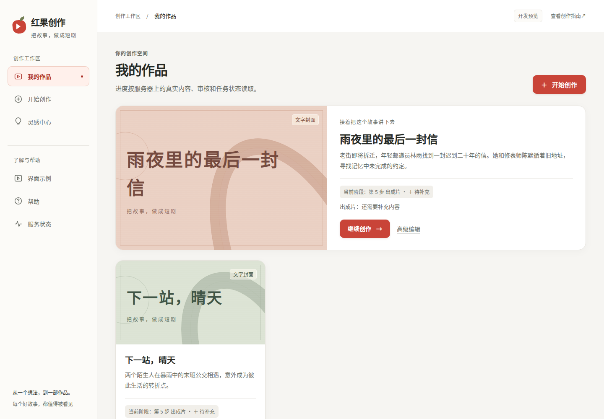
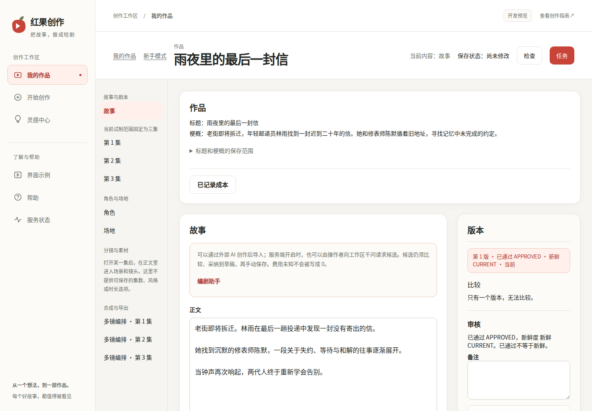
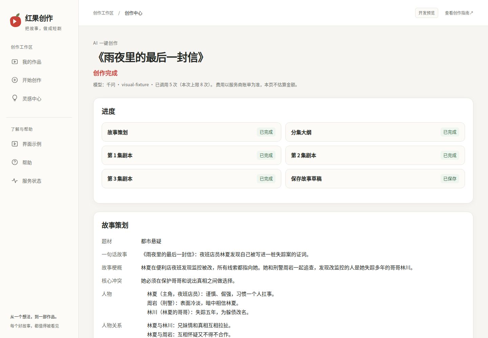
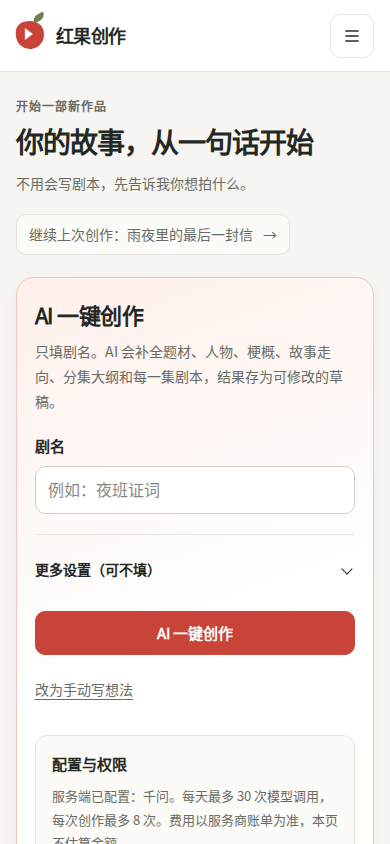
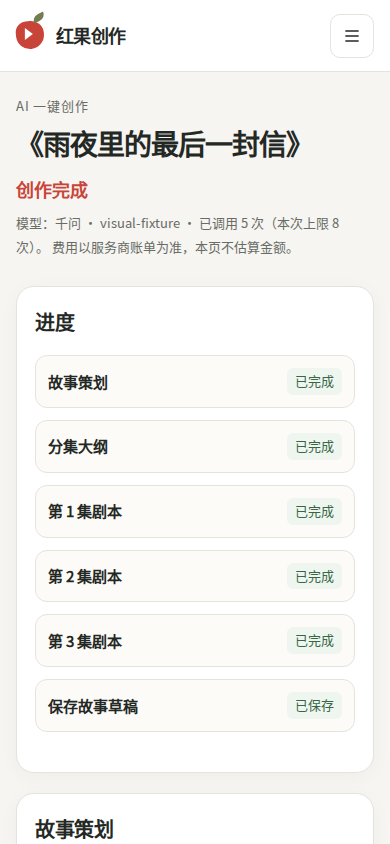

# 全站创作者 UI 统一收尾

## 范围与并行开发

本轮在 `feat/creator-ui-finish` 独立工作区完成，基线为标题创作分支的 `cf0c331c04ea820332e9e1dc771d6d20c7570028`。PR 应以 `feat/title-driven-ai-writing` 为 base，只审查这次界面差异；标题创作先进入 main 后再调整集成关系。本轮不把尚未合并的标题创作当成 main 已有功能。

Claude Code 继续开发标题创作运行时验收。本轮没有改标题创作的请求、恢复、轮询、幂等、令牌或业务状态代码，没有改 API、Worker、数据库、SQL 草案、依赖和锁文件。其他工作区保留原状。

本地目录：`/workspace/scratch/62f2be8edb46/hongguo-ui`。服务器上的运行版本没有改变。

## 界面结果

沿用仓库已有的暖白与珊瑚红方向，把共用 token 落到全部页面和嵌套编辑组件：

- 导航与页眉：统一品牌标记、工作区分组、帮助分组、当前入口、移动抽屉。
- 开始创作与我的作品：统一输入区、AI 创作区、配置区、五步说明、作品卡片、空态和读取失败。
- 灵感中心、界面示例、帮助、服务状态：统一标题、卡片、次按钮、文字链接、弹窗和反馈颜色，保留题材插图本身的色彩。
- 新手五步与高级编辑：统一编辑区、审核、编剧助手、任务、媒体、单镜和多镜合成、成本面板。既有草稿与审核操作保持原样。
- 标题创作进度与结果：桌面两列进度、手机单列，明确区分等待、完成、结果不确定和错误。保留待人工审核、逐集写入、已有剧本冲突和可能已计费的确认。

桌面内容宽度上限 1320px，标题 32px；手机标题 28px、边距 16px。主面板圆角 18px、内层分组 12px、控件 10px，主要控件高度至少 44px。颜色、间距、边框、语义反馈的来源是 `globals.css`，详见 `UI_SYSTEM.md`。

`/` 和 `/create` 仍渲染 `BeginnerStart`。未更换路由，也未把仅在测试中使用的旧 `ProductHome` 当作首页重新设计。

## 本地验证

工具链：Node 24.21.0、pnpm 10.17.0，引擎检查开启。

| 检查 | 结果 |
| --- | --- |
| 锁定安装 | 成功，锁文件未变 |
| Web 及依赖包构建 | 成功 |
| 最终 Web 生产构建 | exit 0 |
| Web lint | exit 0 |
| Web typecheck | exit 0 |
| Web 测试 | exit 0，366/366，未跳过 |
| `git diff --check` | exit 0 |

Web 测试仍会打印已有的 `ECONNREFUSED` 模拟请求噪音。最终 JSON 测试报告为 `success=true`，失败数为 0。没有运行整仓 `pnpm verify` 或数据库集成；本次验证针对界面改动。

新增 `.github/workflows/creator-ui-check.yml`，在 UI 分支及对应 PR 上运行锁定安装、Web 及依赖构建、lint、typecheck、全部 Web 测试。权限仅 `contents: read`，无数据库、供应商密钥和部署步骤。它不替代既有新手、M4 或标题创作真实 API 验收；此文档提交时远端本次检查尚待执行。

## 真实浏览器的视觉核验

Playwright 启动 Chromium 140.0.7339.186，对着本地 Next 生产构建。API 响应由浏览器路由夹具提供，写请求一律禁止；没有连接项目 API、Worker、PostgreSQL 或模型。这是布局与展示核验，不是业务闭环验收。中文字体在截图环境使用 Noto Sans CJK，未加入产品依赖。

1440px 和 390px 各检查 27 个页面/状态，共 54 项：

- 首页、开始创作、我的作品、灵感中心、界面示例、帮助、服务状态。
- 高级编辑的故事、剧本、角色、场地、场景、镜头、多镜编排。
- 新手五步分别检查。
- 标题创作的运行中、生成完成但待审核/写入、结果不确定、逐集冲突、无任务。
- 作品空列表、作品读取失败、合成关闭。

54 项均为一个品牌框架、横向溢出 0，浏览器 `pageerror` 0。另查看了任务区、成本展开、编剧助手、分类弹窗、示例页签、移动导航和 1024px 分类标签。截图所用作品是虚构数据；没有生成或审核真实媒体。

完整页面指标与所选截图 SHA-256 在 `ui-finish/visual-evidence.json`。固定定位底栏在整页截图中仍位于视口位置，因此下列手机预览采用视口截图，不把拼接位置当成真实遮挡。

## 预览截图

开始创作（桌面）：

我的作品：

高级编辑：

标题创作结果：

手机开始创作与标题进度：

## 交接边界

界面改动已完成本地验证。独立 Review、远端检查与标题创作分支的集成关系仍须在合并前确认。没有合并 main，也没有部署或声称服务器页面已经更新。

标题创作是否可用仍由其服务端配置、存储和验收决定。费用 unknown、人工审核、逐集写入/冲突、Mock 素材说明等业务语义没有被装饰性进度或成功提示替代。

Migration = NO；SQL 草案执行 = NO；Paid calls = NO；Deploy = NO。
