# AI Drama Studio V1 领域模型

## ERD

```mermaid
erDiagram
  Workspace ||--o{ Project : contains
  Workspace ||--o{ ProviderConfiguration : configures
  Workspace ||--o{ IdempotencyRecord : scopes
  Project ||--o{ StoryRevision : versions
  Project ||--|{ Episode : has_3
  Episode ||--o{ ScriptRevision : versions
  Project ||--o{ Character : defines
  Character ||--o{ CharacterRevision : versions
  Project ||--o{ Location : defines
  Episode ||--o{ Scene : contains
  Scene ||--o{ Shot : contains
  Scene ||--o{ SceneRevision : versions
  Shot ||--o{ ShotRevision : versions
  Project ||--o{ Asset : owns
  Project ||--o{ UploadSession : uploads
  Project ||--o{ DomainEvent : emits
  WorkflowRun ||--o{ GenerationJob : orchestrates
  WorkflowRun ||--o{ GenerationJobDependency : defines_DAG
  GenerationJob ||--o{ GenerationJobDependency : depends_on
  GenerationJob ||--o{ JobAttempt : attempts
  GenerationJob ||--o{ DispatchOutbox : dispatches
  GenerationJob ||--o{ ProviderEvent : observes
  GenerationJob ||--o{ Asset : produces
  ProviderConfiguration ||--o{ JobAttempt : used_by
  Project ||--o{ WorkflowRun : runs
  Project ||--o{ CostLedger : costs
  GenerationJob ||--o{ CostLedger : incurs
  JobAttempt ||--o{ CostLedger : records
  ShotRevision ||--o{ ShotCharacterReference : casts
  CharacterRevision ||--o{ ShotCharacterReference : appears_in
  Asset ||--o{ ArtifactDependency : depends_on
  StoryRevision ||--o{ ArtifactDependency : source_for
  ScriptRevision ||--o{ ArtifactDependency : source_for
  CharacterRevision ||--o{ ArtifactDependency : source_for
  SceneRevision ||--o{ ArtifactDependency : source_for
  ShotRevision ||--o{ ArtifactDependency : source_for
```

## 实体与责任

| 实体 | 关键字段与责任 |
| --- | --- |
| Workspace | `id`、`name`、`status`；V1 固定单工作区，所有可见资源带 `workspace_id`。 |
| Project | `id, workspace_id, title, premise, status, current_story_revision_id`；三集短剧聚合根。 |
| StoryRevision | `id, project_id, revision_no, content_json, status, input_hash, created_by`；不可变故事设定版本。 |
| Episode | `id, project_id, episode_no(1..3), title, status, current_script_revision_id`；固定排序的集容器。 |
| ScriptRevision | `id, episode_id, revision_no, content_json, source_story_revision_id, status`；不可变剧本与审核状态。 |
| Character / CharacterRevision | 稳定角色身份与版本化外貌、性格、声音、提示词、参考资产来源；角色不直接保存供应商模型字段。 |
| Location | `id, project_id, name, description, canonical_prompt`；可复用场景地点定义。 |
| Scene / SceneRevision | 稳定场景身份及不可变结构版本；`Scene.current_revision_id` 是唯一当前指针，revision 固化剧本来源、地点、排序与语义。 |
| Shot / ShotRevision | 稳定镜头身份和版本化的时长、构图、动作、台词、运镜、来源场景/角色/参考资产；逐镜重生不改变相邻镜头。 |
| UploadSession | `id, workspace_id, project_id, storage_provider, temporary_storage_key, expected_mime_type, expected_byte_size, expected_content_hash?, status(PENDING|UPLOADED|COMPLETED|EXPIRED|FAILED), expires_at, created_by, created_at, completed_at?`；用户上传暂存会话，未完成时绝不是 Asset。 |
| Asset | `id, project_id, asset_type, storage_provider, storage_key, content_hash, media_metadata, status`；对象存储媒体的不可变元数据，核心来源由依赖边保存。 |
| WorkflowRun | `id, project_id, type, requested_by, input_snapshot, status`；用户一次意图的跨任务追踪。 |
| GenerationJob | `id, workflow_run_id, kind, state, input_hash, input_snapshot, dispatch_seq, row_version, next_run_at, lease_owner, lease_until, retry_count, is_critical, progress_weight`；可恢复的工作单元。 |
| GenerationJobDependency | `workflow_run_id, job_id, depends_on_job_id, dependency_condition, created_at`；持久化的 Job DAG 边。 |
| JobAttempt | `id, job_id, attempt_no, provider_configuration_id, provider_request_id, request_snapshot, response_snapshot, error, timing, cost`；一次 Provider submit 或本地执行器正式执行的不可变审计。 |
| ProviderEvent | `id, provider_configuration_id, job_attempt_id, provider_request_id, source, normalized_event_key, external_status, payload_ref, received_at`；poll/callback 的追加式、去重事件。 |
| DomainEvent | `id(ULID/UUIDv7 或数据库序列游标), workspace_id, project_id?, aggregate_type, aggregate_id, event_type, payload_version, payload_json, trace_id, occurred_at, retention_until?`；与状态变更同事务提交的可重放 SSE 来源，不执行任务。 |
| IdempotencyRecord | `id, workspace_id, actor_id, http_method, route_key, idempotency_key, request_hash, response_status, response_body_or_resource_ref, created_at, expires_at`；通用 API 幂等结果记录。 |
| CostLedger | `id, project_id, episode_id?, shot_id?, job_attempt_id?, currency, amount, kind, occurred_at`；按项目/集/镜头可汇总的费用事实。 |
| ProviderConfiguration | `id, workspace_id, capability, provider_key, enabled, encrypted_credential_ref, default_timeout_ms, policy_json`；可替换提供方配置，不将模型名写入业务实体。 |

## 审查后规范模型（本节优先）

**稳定身份表**为 `Workspace, Project, Episode, Character, Location, Scene, Shot, WorkflowRun, GenerationJob, ProviderConfiguration, UploadSession`。`Asset` 是不可变媒体记录但不是版本指针；它必须属于一个 `Project`，不能脱离业务对象存在。UploadSession 创建时绑定 Project，但在校验成功前绝不创建 Asset。**追加式版本/事实表**为 `StoryRevision, ScriptRevision, CharacterRevision, SceneRevision, ShotRevision, JobAttempt, ProviderEvent, DomainEvent, IdempotencyRecord, CostLedger, ArtifactDependency, DispatchOutbox, GenerationJobDependency`。`SceneRevision` 补足 Scene 结构编辑的不可变版本；`ShotRevision.scene_revision_id` 固化镜头引用的场景版本，`ShotCharacterReference(shot_revision_id, character_revision_id, role)` 固化角色版本引用。

当前版本的唯一权威是父稳定表上的外键：`Project.current_story_revision_id`、`Episode.current_script_revision_id`、`Character.current_revision_id`、`Scene.current_revision_id`、`Shot.current_revision_id`。版本行**没有** `is_current`。所有 revision 的 `(parent_id, revision_no)` 唯一，并以 `revision_no` 递增创建；旧版本永远保留。一次当前指针切换与其依赖边失效、审核失效和 outbox 事件必须在一个事务内完成。

`ArtifactDependency` 是 STALE 的权威来源边，字段为 `workspace_id, project_id, dependent_kind, dependent_id, source_kind, source_id, source_content_hash?, created_at`；核心关系不得藏在 JSONB。它连接派生 Asset、修订或合成清单到其精确 revision/Asset 输入。`GenerationJob.input_snapshot`、模型参数和 Asset 扩展 metadata 可以是 JSONB，但不替代这些关系。`DispatchOutbox` 至少有 `id, workspace_id, job_id, dispatch_seq, payload_version, available_at, dispatched_at, dispatch_attempts, last_error, created_at`；每个 Job 进入 `QUEUED` 都创建新行。`ProviderEvent.source` 固定为 `CALLBACK|POLL`，其 `normalized_event_key` 必须确定性生成；DomainEvent 是独立于两者的持久化 SSE 事件。

Asset 统一覆盖图片、视频、音频、字幕和导出文件，字段为 `id, workspace_id, project_id, asset_type, mime_type, storage_provider, storage_key, content_hash, byte_size, width?, height?, duration_ms?, generation_job_id?, metadata, status`。数据库不存大文件，`storage_key` 不是公网 URL。`source_asset_ids` 由 `ArtifactDependency` 表达。其状态仅为 `ACTIVE, STALE, SUPERSEDED, FAILED, DELETED`：`STALE` 是派生对象/Asset 的可用性状态，非存储对象删除；`SUPERSEDED` 表示有意替换但输入未必失效；`FAILED` 无可用内容；`DELETED` 是逻辑墓碑。未完成上传在独立 upload-session 状态中，不冒充最终 Asset。

`WorkflowRun` 只表达编排：`PENDING, RUNNING, SUCCEEDED, PARTIAL_FAILED, FAILED, CANCELED`，按子 job 的关键性和终态汇总进度。它可包含多个 job；局部重生新建一个 run；非关键 job 失败可为 `PARTIAL_FAILED`，关键 job 失败为 `FAILED`。取消 run 仅取消尚未开始的 job 并向进行中 job 请求协作取消，已完成 job、资产和成本均不回滚。

`CostLedger` 每行链接 `generation_job_id` 与可选 `job_attempt_id, episode_id, shot_id`，并记录 `currency, amount_decimal, kind(ESTIMATED|ACTUAL), basis(PROVIDER_REPORTED|LOCALLY_CALCULATED), unit_type, unit_quantity, unit_price_snapshot, provider, model, occurred_at`。失败或取消后的已发生费用仍保留；项目/集/镜头/重生/Provider/模型汇总都从该账本计算。

可审核的 `ScriptRevision`、`CharacterRevision`、`ShotRevision` 与最终合成 Asset 均以同一套元数据作为唯一当前审核权威：`review_status(DRAFT|APPROVED|REJECTED), reviewed_by, reviewed_at, review_note, reviewed_content_hash`。审核不改写内容；审核操作与 DomainEvent 同事务提交。上游变更只令对象 `STALE` 并失去当前可用批准资格，既有审核人、时间与历史事件不删除、不伪造。

## 键、约束与索引

- 所有主键使用 UUID/ULID；所有用户可见表含 `workspace_id`。每个子表以复合外键 `(parent_id, workspace_id)` 指向父表的唯一 `(id, workspace_id)`，Project 归属与 Job/Asset/Cost 的 project_id 也以该方式约束，防止跨工作区拼接。
- `Episode(project_id, episode_no)` 唯一，且 API 只允许 1–3；`revision_no` 在其父实体内唯一。
- `Scene(episode_id, ordinal)`、`Shot(scene_id, ordinal)` 唯一；序号调整使用事务，不能用物理删除重排历史。
- `IdempotencyRecord(workspace_id, actor_id, http_method, route_key, idempotency_key)` 唯一；同键 request_hash 不同返回 `IDEMPOTENCY_KEY_REUSED`。记录以同一事务的占位/完成协议与业务写入提交，GenerationJob 的 inputHash 不能替代它。
- `JobAttempt(job_id, attempt_no)`、`JobAttempt(provider_configuration_id, provider_request_id)` 唯一（后者在非空时）；`ProviderEvent(provider_configuration_id, provider_request_id, normalized_event_key)` 唯一；`DispatchOutbox(job_id, dispatch_seq)` 唯一；`GenerationJobDependency(job_id, depends_on_job_id)` 唯一。
- Asset 的 `(project_id, content_hash, asset_type)` 建索引以支持去重但不强制错误合并。必要索引：`GenerationJob(state, next_run_at)`、`GenerationJob(lease_until)`、`DispatchOutbox(dispatched_at, available_at)`、`DomainEvent(workspace_id, id)`、`DomainEvent(retention_until)`、`ArtifactDependency(source_kind, source_id)`、`ArtifactDependency(dependent_kind, dependent_id)`、`WorkflowRun(project_id, created_at)`、`Asset(project_id, status)`、`CostLedger(generation_job_id, occurred_at)`、`ShotRevision(shot_id, revision_no)`。

## 删除、版本与不变量

业务删除为 `archived_at`/`deleted_at` 软删除；已导出文件、审计、修订、尝试和成本不可物理删除。对象存储以异步保留策略清理未引用临时对象，绝不先删数据库审计。

`StoryRevision`、`ScriptRevision`、`CharacterRevision`、`SceneRevision`、`ShotRevision`、`Asset`、`JobAttempt` 和 `CostLedger` 是追加式记录。父实体的 `current_*_revision_id` 是唯一当前选择指针。每个生成 job 固化输入快照，并由依赖边指向来源修订/资产；所有最终导出输入必须为 APPROVED 且非 STALE。状态转换、当前指针更新、STALE 传播和 outbox 写入在同一数据库事务内完成。
