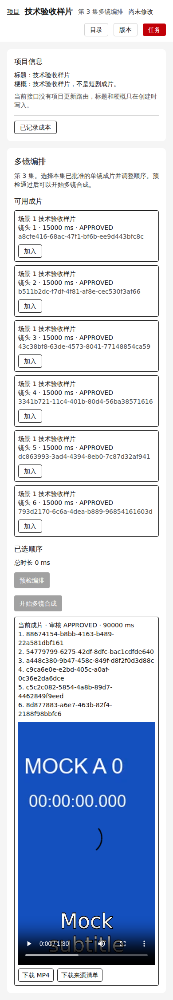

# M4_THREE_EPISODE_SAMPLE_REPORT

## 目录、分支与 SHA

- 工作目录：`D:\Projects\ai-drama-studio`
- 目标分支：`feat/m4-three-episode-sample`
- 起点：`c187f08011dba61060ed7c37a84b764fd11a1f32`（`origin/feat/m4-project-cost-summary`，含已验收源码 `174a6bd564ca77d03241eef13de30271acf4c3ff`）
- 功能验收 SHA：`a92bafb4d6f0647f666ef3fb78bde003e1856b37`
- 390px 验收 SHA：`72b51b9ce59ff997b619eee3b9303c6e84f366a3`
- 报告 SHA：见本文件提交
- `origin/main` 保持 `6548ffe07f54a03ac2c5547d7b724cb329af5932`
- `origin/feat/m4-project-cost-summary` 保持 `c187f08011dba61060ed7c37a84b764fd11a1f32`

## 修改原因与影响范围

同一个项目需要三集技术样片：4×15 秒、5×15 秒、6×15 秒。现有 Mock 视频只有 1 秒，不能靠拉伸、循环或放宽 30 镜、90 秒、64 MiB、渲染超时和并发来凑时长。

因此只扩展 `POST /shot-revisions/:revisionId/generate-video` 的可选 `fixtureId`，取值仅 `sample-15s-a-v1` 与 `sample-15s-b-v1`。不传该字段时，普通 1 秒视频的快照、请求 ID 和输出字节保持不变。图片、配音、字幕、音乐不接受 `fixtureId`。

样片开关 `M4_MOCK_SAMPLE_VIDEO_ENABLED` 默认关闭，生产环境强制关闭。创建、Worker 执行和恢复同时要求该开关、现有 AV 开关、绝对 Mock 对象目录和既有配置。内容读取、合成、审核和导出仍走现有 AV 与对象目录规则，不因开关关闭撤销已生成资产。

影响范围：contracts 中的样片描述与请求身份，providers 中的两份固定 MP4，API/Worker 的视频生成与恢复，合成资格的严格样片分支，以及隔离验收。未改 Python 渲染、渲染 profile、账本规则、历史补账、M2 草稿或 1 秒视频 fixture。

Migration=NO。未新增 Migration，未执行 DROP SCHEMA，未重置既有库。

## 固定样片

两份文件在本机用 ffmpeg `N-116507-gbcf08c1171-20240801`、libx264（成片标记 Lavc61.11.100）和 `C:\Windows\Fonts\arial.ttf`（Arial）离线生成后提交。底色分别为 `0x1A4FBF` 与 `0xC45A12`，画面持续显示 MOCK A / MOCK B，并用帧号和 pts 让首、中、尾可辨。无音轨，无真实人物、商用素材或模型输出。生成命令和探测记录在 `packages/providers/fixtures/sample-video-generation.txt`。

CI 用固定的 ffmpeg `7:6.1.1-3ubuntu5` 探测并完整解码已提交文件，`regenerated=false`。

| fixtureId | 字节 | SHA-256 | 探测 |
| --- | --- | --- | --- |
| sample-15s-a-v1 | 28643 | `4f46bf904a42c7d3acd0cda9d37ccaa2de71dda095a6f91a83c211d5d48f04e7` | 180×320，H.264，yuv420p，5 fps，75 帧，15.000000 秒，无音轨 |
| sample-15s-b-v1 | 28392 | `21f1c5ac372b71337e2a615e3994fdbf812aa79b7a7dc0a88c6de13401e8e60f` | 同上 |

冻结 schema 为 `m4.mock.sample-video.v1`。请求 ID 为 `mock-media|sample-sync-v1|video.generate|<fixtureId>|<jobId>:<attemptNo>`。描述在 contracts，二进制在 providers。domain 只依赖 contracts。

## 三集成片

独立项目 `4bcd1862-3457-45d8-ab73-8885b236c181`，标题与正文为技术验收样片。同一故事下三集剧本已审核，场景与镜头为 CURRENT。15 个逻辑镜头各自生成 VIDEO Asset。每集第 1 个镜头另走现有 Mock 配音、音乐和字幕；它们仍是短静音和固定字幕，不是朗读或音乐质量验收。

顺序：第 1 集 A、B、A、B；第 2 集 B、A、B、A、B；第 3 集 A、B、A、B、A、B。全部单镜成片先批准，再由浏览器走现有预检、多镜合成、批准和下载。故障与开关负例在另一项目 `6473ab25-d5d8-49f3-a4b7-755e08935259`，没有改写这三集的最终状态。

输出为 1080×1920。Chrome 以 16 倍速实际播放到 ended，解码帧数与 25 fps 时长一致。ffprobe、Asset 与浏览器时长差均为 0 ms，业务 90 秒上限未放宽。

| 集 | 镜头 | 目标 | Asset / 下载 SHA-256 | 字节 | 集级合成 |
| --- | --- | --- | --- | --- | --- |
| 1 | 4 | 60000 ms | `465e48daf93f92ba903772d68740564e687719ca512b3bf3fd9116aa9c50b2c1` | 878798 | Job `040fa04a-dc89-4f2b-a626-2156ed232dcc`，attempt `f8be59c1-d772-4d6e-8516-6a2fb7141b0f`，15150 ms |
| 2 | 5 | 75000 ms | `d2c6a547095ed222f624102b2fd3d37f64bbd95370e148f3d7e629012c452d7d` | 1095004 | Job `fff627f1-fbbb-4f88-b212-e0da9b862ab5`，attempt `8355e342-5db3-4a4c-a4e0-0a257e6128b1`，18152 ms |
| 3 | 6 | 90000 ms | `1d54551c83212a072ff64eeb4c85306389e4fc46c31493a4a28a6ce6ed067e54` | 1312728 | Job `28911ef6-0040-432a-8e08-4f90bacb810b`，attempt `0d54f353-0f27-40dd-a841-26800ea30def`，21203 ms |

三集成片均为 ACTIVE + APPROVED。审核哈希等于成片 SHA-256。来源清单的 Job、attempt、15000 ms 分段和依赖边与数据库一致。每个 15 秒分段的首、中、尾抽帧颜色符合 A/B 顺序，三段帧哈希彼此不同。最终 MP4 经 ffmpeg 完整解码。390px 横向溢出为 0。

## 恢复、成本与只读窗口

样片恢复发生在真实 Worker 上：Job `51d666fd-54b7-4abe-9366-c8bd86ca9eb7`，attempt `04828e45-bad7-405a-866d-6e9d246f5b7e`，请求 ID `mock-media|sample-sync-v1|video.generate|sample-15s-b-v1|51d666fd-54b7-4abe-9366-c8bd86ca9eb7:1`，Asset `ec2f5e48-8419-426f-bb1c-601dc52b2ce3`，一条 ACTUAL USD 0。原 attempt 与请求未变。本次没有测量 Worker submit 次数。

开关关闭后，已绑定样片 Job `c7692df3-ef73-41f7-aedf-228bc28a2e91` 以 `MOCK_MEDIA_NOT_CONFIGURED` 结束，没有 Asset 或成本。随后普通视频 Job `a1c4415d-f153-41d3-a129-9247b87d8d5e` 仍以 1 秒成片成功。

该样片项目账本为 24 行 ACTUAL USD `0.00000000`。15 次单镜合成和 3 次集级合成共 18 次本地编码没有账本行，页面沿用“本地编码等成本尚未计量”的既有说明。这不是完整生产成本。

交付读取窗口内，三份 MP4、三份 JSON 清单和成本 GET 没有改变十张业务表的指纹：

| 表 | 行数 | 指纹 |
| --- | --- | --- |
| generation_job | 161 | `2b21cc2e7530d0f60b9e0861cab1aaf84e5af8c6e70ed8b71595acfd2a8f7287` |
| job_attempt | 165 | `463ae9700fa5337b98497ff44236699bd597344d314bf5d18a093a5b51b275dc` |
| workflow_run | 161 | `754ef811eefc391620c0b0f07244f28dee7b45be9c4e4821351a359047ad7286` |
| asset | 157 | `728b22dc0d827deda3b0c033d7f214bd72994d79966d685e78a4580e58879c2e` |
| cost_ledger | 87 | `65d32e88f54c38ccb8cc99168434c43519a945a4c328cda9787f2b036e0bfb7d` |
| dispatch_outbox | 156 | `741d3986d5be91becd7796fc567be33f427bfd4710240ae83770c248f5840c6b` |
| domain_event | 1395 | `db12570b59b1ac883b2a2c7b35f05eec7d17451c4d5713aac89bdf85499c3a33` |
| asset_dependency | 90 | `ec99a081f523c1801211a22349554fe0a7229dd11b25d1abe3ee6429982c55a7` |
| asset_revision_dependency | 333 | `21e92329968908236fddf1117c557c97fc3004c85cf10f2d57b15e85fe0a2859` |
| idempotency_record | 529 | `bfd885f3911cc7b4f822c15d511cfb3302056642dace509f8767e5909bf9ae83` |

## 模拟测试与真实执行

定向测试在进程内检查 1 秒视频兼容、冻结快照、请求身份、全新 adapter 的 inspect/resolve、对象写入失败后的原 attempt、损坏内容、开关和合成资格伪装。它们不代替真实渲染。

390px 截图前先等第 3 集已知的 6 个候选成片全部出现，并且“正在加载候选成片”消失，再检查目标卡片、APPROVED、两个下载按钮和视频 metadata。等待结束后重新读取元素边界和页面尺寸，测量溢出并截整页。截图后再读一次。页面高度和目标位置不一致时最多重试 3 次，仍变化则阶段失败。本次第 1 次即稳定。

视口 390×844。最终页面 390×2254。目标 Asset `e2307f4e-69a8-4e48-80c5-b3b3d867cfbc` 为 ACTIVE + APPROVED，video `readyState` 4、1080×1920、90000 ms。播放器位于 y=1627、高 548；下载 MP4 与来源清单位于 y=2183、高 30。6 个候选成片从 y=474 排到 y=1210。PNG `docs/m4-three-episode-sample-390.png` 为 390×2254，与页面滚动尺寸相同，完整包含候选列表、播放器和两个按钮。横向溢出 0。

真实闭环是 GitHub Actions run `37100980441` attempt 1，job `111140294936`，HEAD `72b51b9ce59ff997b619eee3b9303c6e84f366a3`。隔离库 `m3av_37100980441a1` 在迁移前 `public_tables=0`，随后只应用已有 migration。Worker、FFmpeg 6.1.1 和 Chrome 完成合成、播放、抽帧、完整解码与下载。证据包 artifact `11266867420` / `m4-three-episode-sample-e2e-evidence`，13697382 字节，SHA-256 `fa0c40562dcfd4250cfa0157d20b1fe142a993072dd16c740da6e207534e68ec`。

52 个必需阶段全部 passed。无 skipped、failed、fatal、restore 或 cleanup 失败。compose down 退出码 0。

## 未执行项与剩余边界

未测量样片 Worker 的 submit 次数。未开放普通用户可见的 fixture 选择器。样片开关在生产环境保持关闭。未接入真实 Provider、付费模型或 ComfyUI，未做时间拉伸、循环凑时长、任意上传或外部 URL。账本只记录 Mock ACTUAL 0；本地编码未计量，完整生产成本仍未知。

三集长时技术样片闭环通过。
