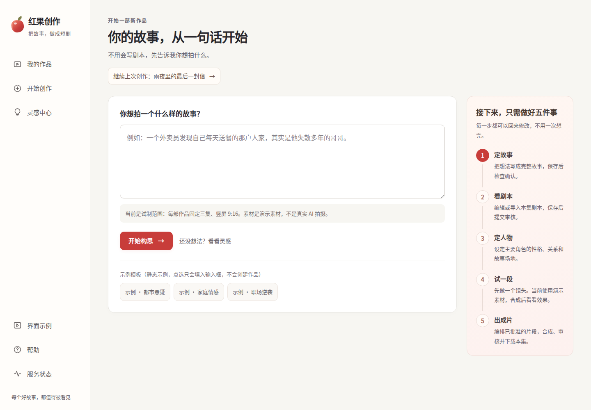
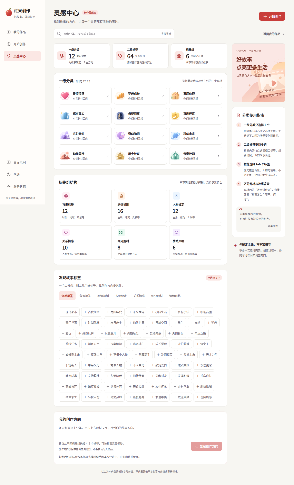
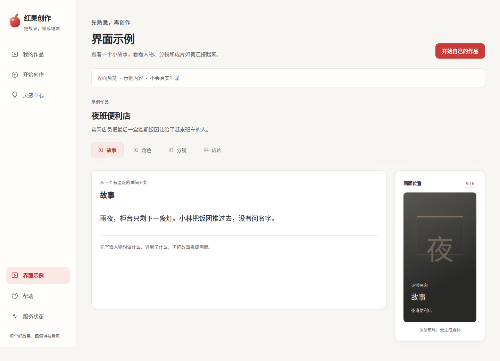
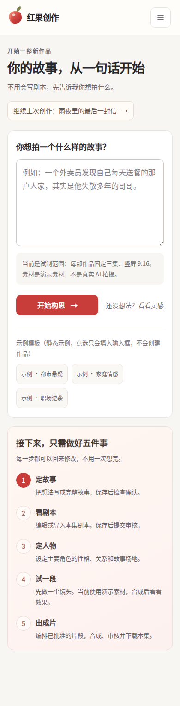

# 红果创作 · 全站 UI 统一

基线 `ce1cbb7c0481c6564d92e2f5206aeca26ec70fd0`。分支 `feat/unified-creator-ui`。

## 原因与范围

此前只有新手路线采用暖白/珊瑚红，其余路由仍存在独立暗色框架、蓝灰分类主题及旧品牌。现在全站使用唯一 `CreatorShell` 与 `globals.css` tokens，`BeginnerShell` 只转发参数；移除独立新手 shell CSS 和旧暗色/亮色分支。

统一范围：首页、开始创作、我的作品、灵感中心、示例、帮助、状态、新手五步、高级工作台及其中的编辑、版本、审核、媒体、合成、成本、助手、任务抽屉。分类插画和媒体画面保留内容颜色。规范见 `UI_SYSTEM.md`。

不改变 API、Worker、数据库、依赖或锁文件；保存/草稿/If-Match/409、能力检查、重试和状态恢复规则保持。新增呈现语义包括统一当前导航、示例页签的键盘操作。Migration=NO，Paid calls=NO。

## 验证

- Node 24.21.0、pnpm 10.17.0，锁定安装。
- Web：31 files / 296 tests 通过，包含统一导航、移动焦点、示例键盘操作及既有业务组件回归。模拟 fetch / happy-dom，不是后端闭环。
- 全仓 lint、typecheck 通过；`pnpm build` 9/9 通过；最终 Web 生产构建通过；`git diff --check` 通过。
- 本地 `pnpm verify` **未通过**：两个既有 Provider CLI 子进程测试被当前环境的 Unix IPC 限制阻断，`tsx` 报 `listen EPERM /tmp/tsx-0/...pipe`。未关闭测试或改写断言。其余被 Turbo 中断的任务不计入通过；完整 verify 仍须由对应提交 CI 完成。
- 独立代码/视觉复核没有未处理 P0/P1；发现的控件高度、选中文字对比度、成本按钮和 1024px 分类布局已修正。

## 本地真实浏览器视觉检查

生产构建 + Playwright 1.55.1 / Chromium Headless Shell 140。API 数据由只读路由替身提供，**不等于真实 API / Worker / 数据库验收**。没有 POST、付费调用或写入正式数据。示例项目仅用于截图，没有放进产品代码。

44 个页面/状态覆盖桌面1440与手机390：首页、创建、作品非空/空/失败、分类、示例、帮助、状态、高级编辑各模式、新手五步、合成关闭态。每页只有一个统一框架，背景/文字 tokens 一致，无旧品牌，无横向溢出和 pageerror。最终共 70 张截图。按钮圆角调整后的生产构建另跑 6 项定向检查，仍无溢出或页面错误；任务主按钮实测 44px 高、10px 圆角。另有任务/成本/助手展开、分类详情、示例其余页签、选中角色/场地，以及1024px分类标签检查。

中文字体仅注入本地截图浏览器，未新增产品字体依赖。移动固定底部按钮在整页截图中仍位于截图时的视口底部；页面保留滚动到底的安全空间。

以下为这次改动的视觉示例（API 为模拟数据）：

## 发布边界

本报告随源码提交，记录提交前验证。PR 与合并后的 CI 以 GitHub 对应 SHA 为准，不借用上一版结果。此执行环境没有测试站点的服务器连接；本地截图及 PR 通过均不能当作 drama.playhubs.cn 已更新。
