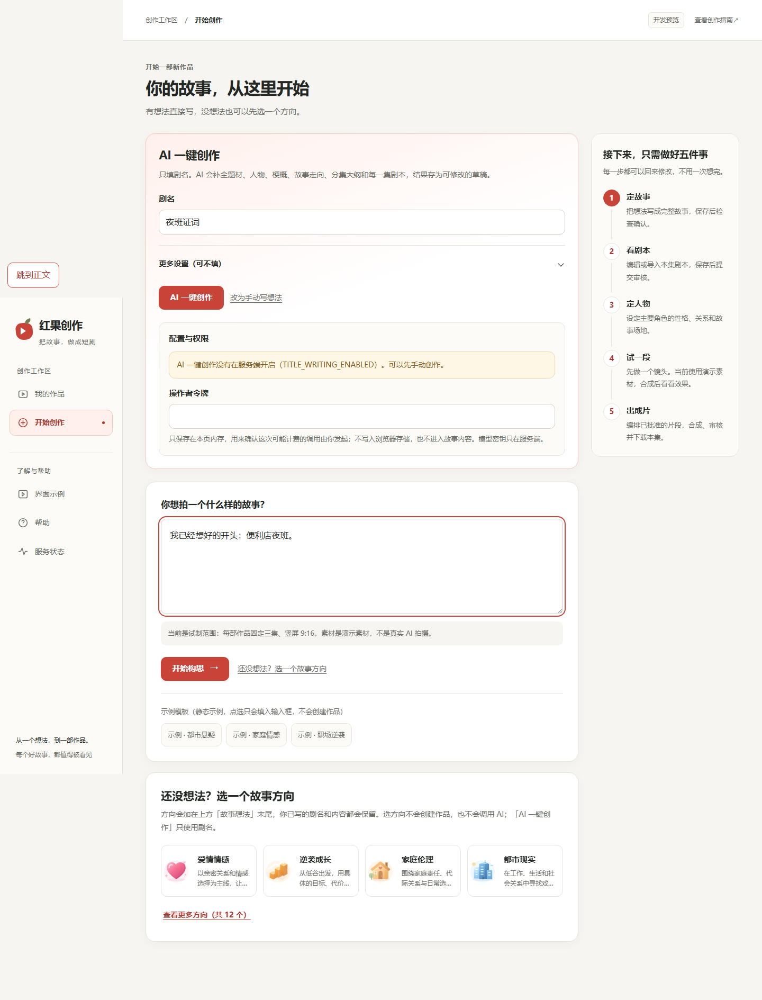
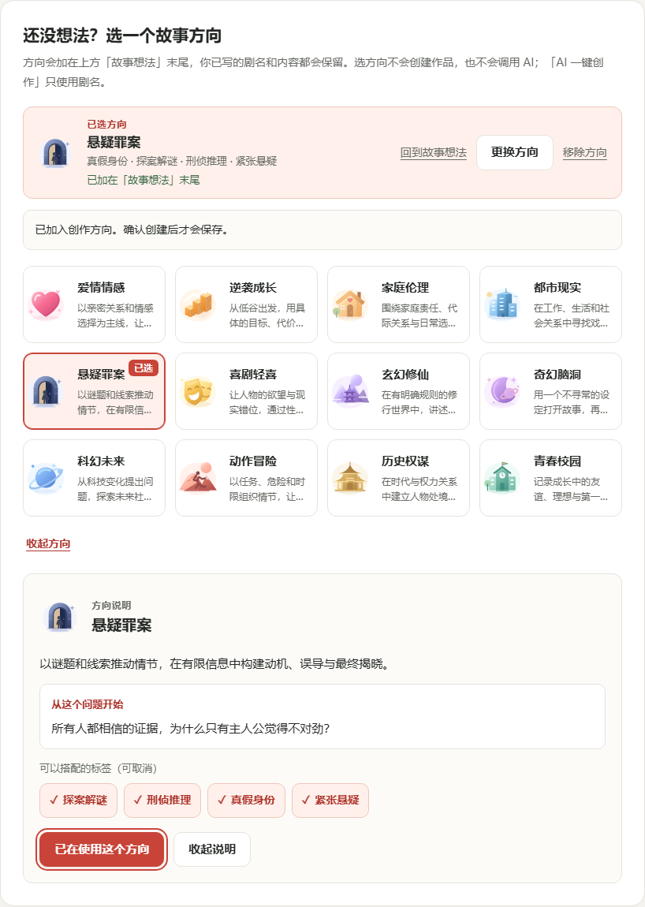
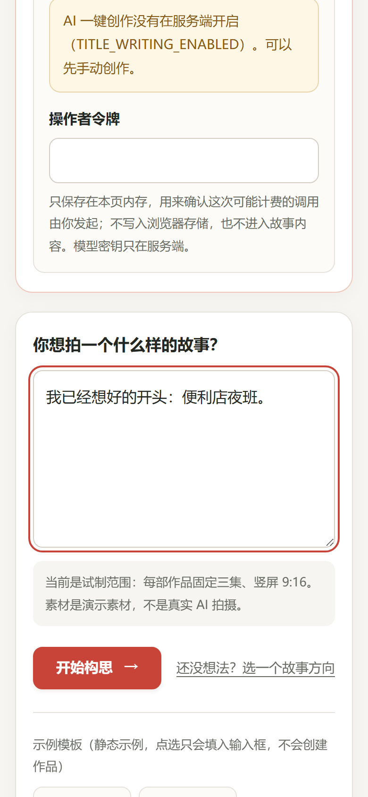
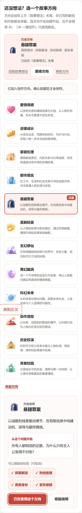

# 开始创作与灵感中心合并

分支 `feat/unified-create-inspiration`，基线 `origin/main` `ed73f5d09d9f9be239074786c506e2519794a406`。只改 `/create` 布局、灵感展示组件、导航与旧入口、直接相关测试和文档。没有改 API、Worker、数据库、模型适配器、审核、费用、任务恢复、幂等协议或功能开关。Migration = NO；SQL 草案 = NO；Paid calls = NO；Deploy = NO。

## 页面

`/create`（`/` 渲染同一组件）自上而下：

1. 标题「你的故事，从这里开始」，说明「有想法直接写，没想法也可以先选一个方向。」
2. 原有「AI 一键创作」（只用剧名）和「你想拍一个什么样的故事？」手动表单。两个提交协议不变、不合并。
3. 内嵌灵感区「还没想法？选一个故事方向」：默认 4 张方向卡片，「查看更多方向（共 12 个）」在本页展开/收起。点卡片在本页显示题材说明、「从这个问题开始」和可搭配标签（可取消），焦点移到说明标题。
4. 原「确认创建作品」流程。

数据全部来自已有 `creative-taxonomy`（12 个题材、推荐标签、说明），没有新增数据或模型功能。

## 交互规则

- 只有点「用这个方向」才通过已有 `appendOnce`/`premiseBlock` 把方向追加到「故事想法」末尾。剧名、作品名称和已写正文不会被覆盖；同一方向不会重复追加。
- 应用后显示「已选方向」（题材、标签、状态），提供「回到故事想法」「更换方向」「移除方向」，表单内也显示已选方向。
- 更换/移除用 `removeOnce`：只删除本页加入且仍**原样**存在、只出现一次的那段方向文字及其前面的空行。用户在前后写的文字保留。文字被改过时不做模糊匹配，正文保持不变并提示；更换时可选择「保留原文字，另外加入」。
- 查看、展开、收起、打开说明都不改草稿，也不轮换幂等标识。
- 创建提交中沿用表单冻结：灵感区可查看，应用、更换、移除和标签都禁用，处理函数也会拒绝。
- 刷新恢复沿用现有 sessionStorage 草稿；草稿里仍原样含有已存方向时显示为「已加入」。所选方向沿用灵感中心原 localStorage 键，没有新增存储。
- 选方向不会创建作品，也不会启动模型。AI 关闭时页面仍显示原有「没有在服务端开启…可以先手动创作」提示和手动入口。

## 导航与旧入口

- 主导航去掉「灵感中心」：我的作品 / 开始创作 / 界面示例 / 帮助 / 服务状态。
- `/categories` 返回 307，跳转到 `/create?direction=1#inspiration`。`direction=1` 是已有标记，只让页面显示本浏览器之前在灵感中心存的方向，需用户点击才会加入。URL 不带故事正文、令牌或密钥。
- 页面内「还没想法？选一个故事方向」改为本页锚点 `#inspiration`。
- `CategoryCenter` 组件和测试保留，但不再挂载路由；分类数据和 `/studio?direction=1`、项目方向绑定、编剧助手带入都没有改。

## 验证

### 模拟请求（单元与组件测试，fetch 为 mock）

Node 24.21.0，pnpm 10.17.0。

| 检查 | 结果 |
| --- | --- |
| Web lint | exit 0 |
| Web typecheck | exit 0 |
| Web 测试 | 39 个文件，379/379 通过（新增 `unified-create.spec.tsx` 12 项、`creative-direction-link.spec.ts` 2 项） |
| Web 生产构建 | exit 0 |

新增定向覆盖：已有正文和标题在选方向后保留；同一方向不重复；更换/移除不删除用户输入；改过的方向文字保持不变；提交中灵感区不能修改冻结内容，提交的 premise 为冻结值；浏览方向时幂等标识不变，刷新后恢复；旧 `/categories` 重定向；旧 `direction=1` 只提示、不自动加入；AI 关闭时手动创建只发一次 `POST /projects`，没有 title-run 请求；仅浏览和选择不发任何写请求。

### 真实浏览器（Chromium 140，本地生产构建，API 为路由夹具）

Playwright 驱动 `next start`。所有 `/api/v1` GET 由夹具应答（作品列表为空、AI 创作关闭），**写请求全部拦截并记录**。不是真实 API 验收。1440×900 和 390×844 各一轮，共 56 项检查全部通过：

- 有想法直接填写；无想法时用键盘从链接跳到灵感区，展开更多、打开说明（焦点移到说明标题）、标签可用键盘操作、应用方向。
- 应用后正文与 AI 剧名都在；卡片「已选」标记、状态文字、表单内已选方向都可见。
- 回到表单继续写，更换、移除都保留用户文字；刷新后恢复草稿和已选方向。
- `/categories` 落到 `/create?direction=1#inspiration`；导航无「灵感中心」。
- 横向溢出 0；灵感区控件无遮挡、高度至少 44px；`pageerror` 0；写请求 0；跳到正文链接未聚焦时位于视口外。

截图与 SHA-256 记录在 `unified-create/browser-evidence.json`。整页/元素截图中固定定位的「跳到正文」可能被拼接到页面中部，这是截图方式造成的，实际视口内已用检查确认隐藏。

### 真实 API 验收

`scripts/beginner-web-acceptance.mjs`（CI `Beginner creator web`：真实 API、Worker、PostgreSQL、FFmpeg）已改为新标题和锚点，增加 `/categories` 重定向、本页选择/移除方向，并继续确认浏览和模板不会创建作品。本地没有运行，以 PR 的 CI 结果为准。

### 未执行

整仓 `pnpm verify`、数据库集成和其他 M1–M4 端到端没有在本地运行，本次未改动这些代码。服务器没有部署。

## PR #60 Review 修复

Codex 在 `12fca24` 提出 3 个 P2，均已修复并补测试：

1. 想法里原本就有一段完全相同的方向文字（例如用户粘贴的）时，页面不再把它当作本页加入的；状态显示「你写的，移除时不会删除」，移除或更换都不会删它。
2. 移除方向后想法变成空白时退出确认步骤，不能提交空梗概。
3. 本页加入的方向文字被改过后，再点同一方向不再追加第二份，按「已修改」提示处理。

刷新恢复时，若恢复的想法里仍原样含有本浏览器存的方向段落，仍视为本页加入（这个存储只由「用这个方向」写入）。修复后重新跑了 lint、typecheck、web 测试 379/379、生产构建和浏览器检查 56/56。
