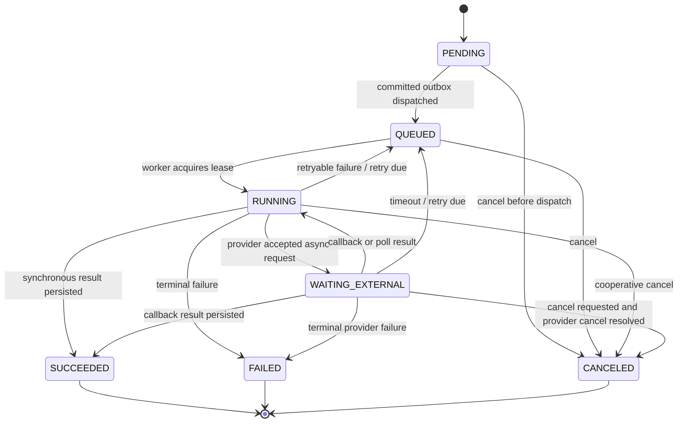
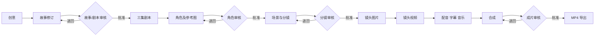

# 工作流与任务状态机

## GenerationJob 状态

合法转换仅限上图。终态 `SUCCEEDED`、`FAILED`、`CANCELED` 不可重新打开；“重试”不会把 `FAILED` 直接变成 `RUNNING`，也绝不篡改既有成功结果。API 对非法转换返回 `JOB_INVALID_TRANSITION`。

## 重试、超时与取消

- 默认最多 3 次实际 Provider 尝试（首次 + 最多 2 次重试）；Provider 配置可把上限调低，不能由客户端调高。只重试网络中断、429、5xx、可证实的临时 Provider 错误和租约丢失；不重试验证、策略、认证、配额耗尽或不兼容输入错误。
- 退避为 `min(15 min, 30 s * 2^(retry_count-1))` 加 0–20% 随机抖动；Provider `Retry-After` 优先。每次尝试和费用独立记录。
- 任务有软超时和硬超时。软超时触发 query/poll；硬超时尝试 `cancel`，保留 `WAITING_EXTERNAL` 直到获得终态或达到回收阈值，随后标记 `FAILED/TIMEOUT`。不因网络超时假设 Provider 未执行。
- 取消是请求而非即时承诺：未领取任务直接 `CANCELED`；运行中写 `cancel_requested_at`，Worker 先调用 Provider cancel，安全点前停止媒体工作。若结果已持久化，则返回成功事实，取消不回滚资产或成本。

## 幂等与恢复

创建 job 要求 `Idempotency-Key`；唯一键将相同主体、路由、规范化输入和有效窗口映射到同一 job。Worker 仅以条件更新领取 `QUEUED` job，或在同一 job 的租约过期后接管 `RUNNING` job；一份消息可被重复投递而不产生第二次 Provider submit。提交前持久化 attempt 和 deterministic client request key；Provider request id 到账后立即持久化。

Worker 重启时，reconciler 扫描过期租约、`WAITING_EXTERNAL` 和 outbox 未投递记录：有 provider request id 的任务先 query；没有 request id 的任务按幂等键安全重投。重复回调/轮询由 Provider request/event 唯一键吸收。孤儿任务（队列无消息、状态可运行且超过调度宽限）重新入队；孤儿 Provider 请求（仅有 attempt）先查询后决定成功、重试或人工介入，绝不盲目重提。

## 短剧生产工作流

每一箭头可创建 `WorkflowRun`，其子 job 由依赖关系推进。视频 job 的创建前必须验证相应 ShotRevision 及其角色/场景来源已人工批准；否则返回 `REVIEW_REQUIRED`。局部重生从一个 Shot/ShotRevision 开始，只创建该镜头及其直接派生图片、视频、音频/字幕（如内容改变）的新版本；不改变其他镜头，合成资产标记 STALE 等待重新合成。

## 审查后 Job、Attempt 与运行恢复契约（本节优先）

自动重试复用**同一个**非终态 `GenerationJob`：`RUNNING` 或 `WAITING_EXTERNAL` 因可重试结果只转到 `QUEUED`，下次领取创建编号递增的 `JobAttempt`。一次 `JobAttempt` 是一次实际 Provider submit 执行，不因单次 poll 递增；poll 和 callback 的原始脱敏结果以 `ProviderEvent` 追加审计。对已经 `FAILED`/`CANCELED` 的用户手动 retry 创建新的 GenerationJob（新的 idempotency scope）和新的 JobAttempt 序列，可继承不可变输入快照但不得修改旧 job。最大 attempt 数由 ProviderConfiguration 的受限策略配置（默认 3）；客户端不能提高它。

每次转换都使用 `UPDATE ... WHERE id=:id AND state IN (...) AND row_version=:expected`，领取时另要求 `lease_until < now()` 或 owner 相同；成功更新递增 `row_version`。提交前先写 Attempt 和确定性的 provider client request key；Provider 返回 request id 后立即以条件更新保存。回调/API 处理须先通过验签，然后以 `ProviderEvent(provider_configuration_id, provider_event_id)` 唯一键插入；重复 event 无副作用。callback 与 poll 竞争时，只有取得 `WAITING_EXTERNAL → RUNNING` 处理租约者能落终态；另一方重读后退出。`SUCCEEDED` 的重复回调被记录并忽略，已取消任务的迟到成功也被记录：若取消生效在结果落库前，则不激活输出 Asset，job 仍为 `CANCELED`，但已发生成本保留；若成功已先提交，取消返回 `JOB_TERMINAL`。

硬超时不是直接重提：先 query，必要时尽力 cancel，保留远程请求和事件审计；最终远程成功在尚未终态时可被接纳，否则按上述迟到结果规则处理。取消是尽力、协作式保证，不承诺中止已经在 Provider 执行的计费。reconciler 定期扫描过期 `RUNNING`、到期 `WAITING_EXTERNAL`、待投递 outbox 和调度宽限外 `QUEUED`；它先 query 已有请求，再按同一 job 的可重试转换入队。Redis 丢失只会丢调度信号，扫描器会补回。

`WorkflowRun` 的状态与 Job 状态不重复：它汇总其 DAG 子 job 的进度和关键性。所有关键 job 成功为 `SUCCEEDED`；关键 job 终态失败为 `FAILED`；只有非关键 job 失败为 `PARTIAL_FAILED`；取消未开始 job 且没有仍运行 job 后为 `CANCELED`。已成功的子 job、资产和成本从不因 run 取消回滚。
