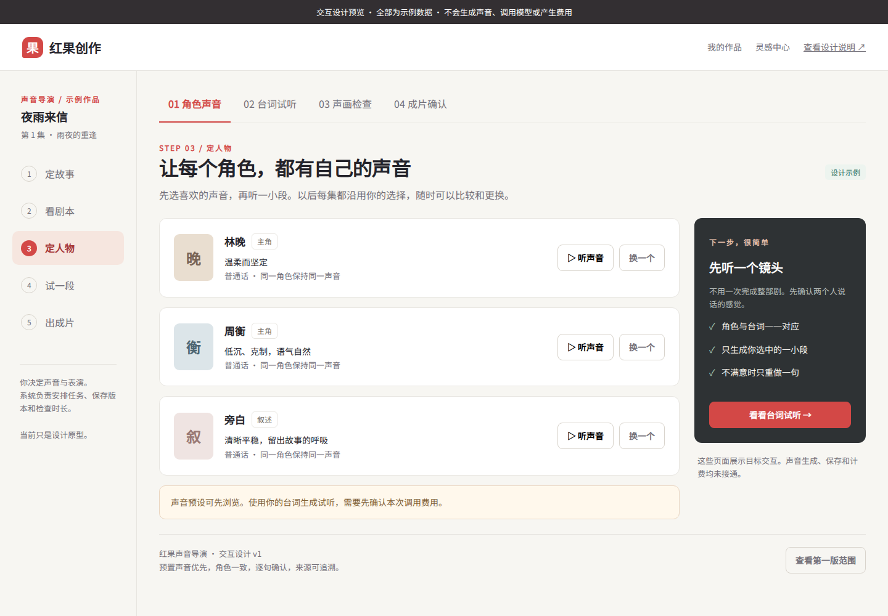
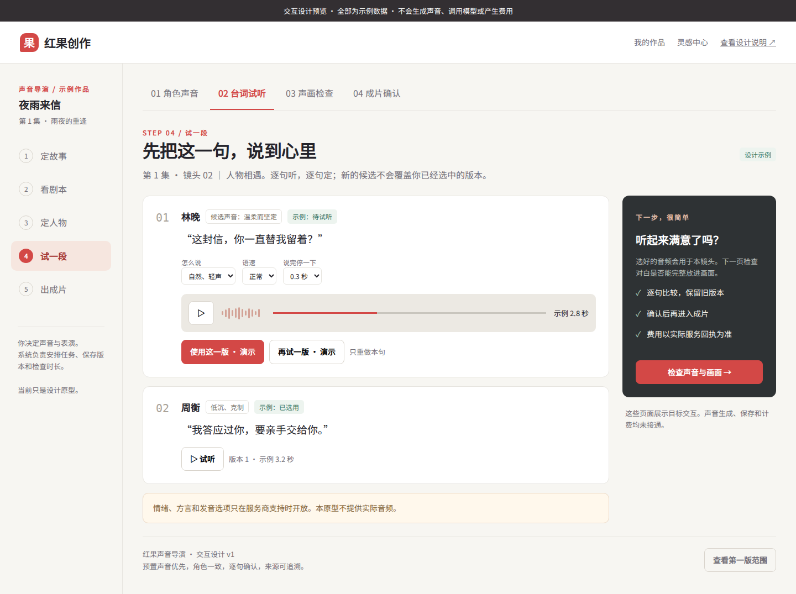
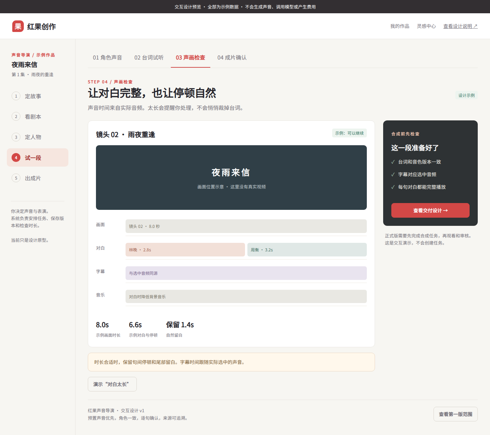
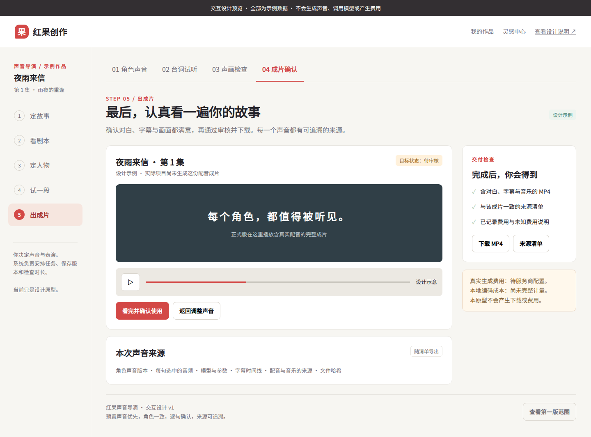

# 角色配音交互设计图

这些图片来自[离线 HTML 原型](character-voice-preview.html)，全部是示例内容，不是真实产品运行截图。下载 HTML 后可直接用浏览器打开，不需要 Node、服务端或密钥。

完整[产品与技术设计](../CHARACTER_VOICE_DESIGN.md)；[开源调查](../VOICE_OPEN_SOURCE_RESEARCH.md)。

## 四个页面

### 1. 角色声音

让新手为每个角色和旁白选择稳定声音。林晚的“换一个”可演示选择；试听按钮说明当前没有真实音频。

### 2. 台词试听

逐句试听与明确选用。候选保留自己的音色身份，换角色声音后旧候选不能直接选入新方案。“再试一版”只切换示例状态。

### 3. 声画检查

检查所选声音与版本是否一致。台词太长时阻断继续，保留用户选择；不自动截尾。时间线、音频时长和画面均为示意。

### 4. 成片确认

真实功能将继续走既有审核和下载资格。原型只说明目标页面，没有实际视频或下载。

## 手机布局

| 页面 | 390px 设计图 |
| --- | --- |
| 角色声音 | [查看](voice-cast-mobile.png) |
| 台词试听 | [查看](voice-lines-mobile.png) |
| 声画检查 | [查看](voice-mix-mobile.png) |
| 台词超时阻断 | [查看](voice-overflow-mobile.png) |
| 成片确认 | [查看](voice-delivery-mobile.png) |

## 本轮检查的范围

2026-10-07，用真实 Chromium `153.0.8010.0` 打开本地 HTML；截图字体使用本地 Noto Sans SC。字体和浏览器工具只用于设计检查，没有加入产品依赖或锁文件。

- 1440px 与 390px 的四个页面均无文档横向溢出；步骤栏允许自身横向滚动。
- 标签页方向键/Home/End、弹窗 Escape 与焦点返回、示例选声和选用可操作。
- 换声后旧候选不可选用，声画检查阻断；生成新示例并选用后恢复。
- 演示时长冲突时继续按钮禁用，解除冲突后恢复。
- 无页面 JavaScript 异常，无 HTTP/HTTPS 请求。
- HTML 内联 JavaScript 语法、新设计文档相对链接、`git diff --check` 通过。

结构化记录：[voice-preview-checks.json](voice-preview-checks.json)。本轮另做设计一致性复核，修正了未变句继承、回执先持久化、查询与重发的边界以及原型旧声音状态。

没有运行项目 `pnpm verify` 或原 52 阶段：本次仅修改文档与独立设计原型，没有产品代码变化。以上不代表真实 API、数据库、TTS、播放音质或服务器页面验收。未执行 Migration、模型调用或部署。
